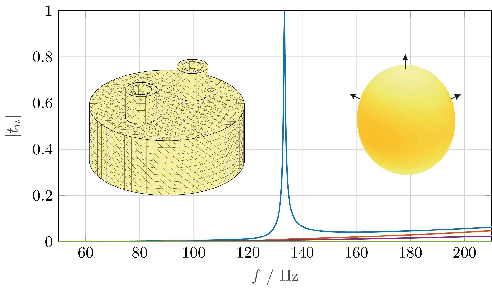

# Characteristic-Mode-Analysis-of-Acoustic-Scatterers
This repository contains MATLAB code evaluating characteristic modes of acoustic scatterers. The boundary element method with equivalent surface impedance is used. The object is described by a triangular mesh.
The theory is described in [[1]](#references). Run script "charModesOfHelmholtzResonator.m" to replicate the results of Section 7.3. Refer to the commentaries in the code for more details on the implementation.

The code uses some functions from ATOM, see http://www.antennatoolbox.com/. Parts of the free version of ATOM can be found in the GIT folder and must be added to the MATLAB paths, including subdirectories.

# References

[1] Lukas Jelinek, Kurt Schab, Viktor Hruska, Miloslav Capek, Mats Gustafsson, "Characteristic Mode Analysis of Acoustic Scatterers," Journal of Sound and Vibration, to be published
